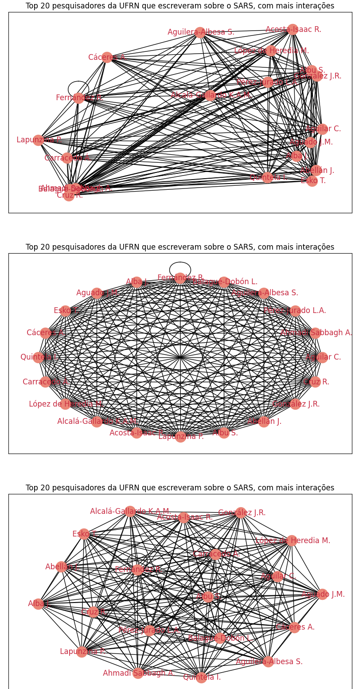

# Análise de Rede de Coautoria
Alunos: 
 - Artur Gabriel Rodrigues Queiroz
 - Pedro Victor Soares Ferreira
   
Este README descreve a análise de uma rede de coautoria criada a partir de um conjunto de dados Scopus.

## Gráfico de Rede dos 20 Autores Mais Conectados

O gráfico de rede acima mostra os 20 autores com maior número de conexões (coautorias), juntamente com suas ligações entre si.

## Densidade da Rede

> Densidade da rede: [0.13921452257694258]

A densidade da rede indica a proporção de conexões existentes em relação ao número total possível de conexões.

## Histograma dos Graus da Rede

O histograma dos graus da rede mostra a distribuição do número de conexões (grau) para cada autor na rede.

## Tipos de Layout da Rede

Esta figura ilustra diferentes layouts da rede para os 20 autores mais conectados. Os layouts "Random", "Circular" e "Spring" representam formas distintas de organizar os nós e arestas do grafo, oferecendo diferentes perspectivas sobre as relações entre os autores.
