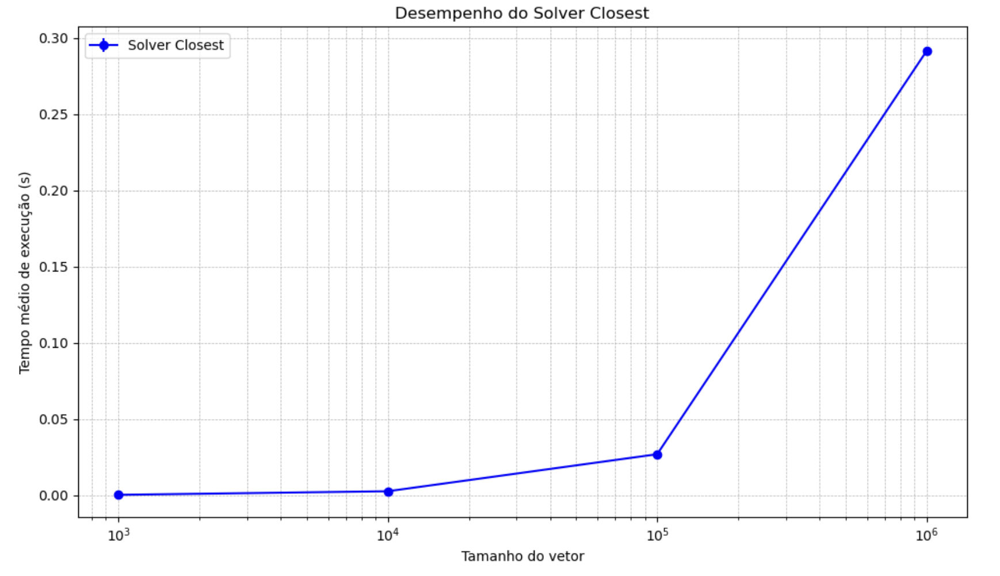

# Desafio 1: Análise de Desempenho do Algoritmo Solver Closest

Este documento descreve a análise de desempenho do algoritmo `solver_closest`, que encontra a menor diferença absoluta entre dois elementos em um vetor. O código foi implementado em Python e avaliado em termos de tempo de execução para vetores de diferentes tamanhos.

## Metodologia

O algoritmo foi testado com vetores de tamanho 10³, 10⁴, 10⁵ e 10⁶. Para cada tamanho de vetor, o algoritmo foi executado 10 vezes, e o tempo médio de execução e o desvio padrão foram calculados.  Um intervalo de confiança de 95% também foi calculado para cada tamanho de vetor, usando a distribuição t de Student.

## Resultados

Os resultados da análise de desempenho são apresentados no gráfico abaixo e no arquivo `resultados_closest.txt`. O gráfico mostra o tempo médio de execução do algoritmo em função do tamanho do vetor, com barras de erro representando o intervalo de confiança de 95%.

Os dados completos, incluindo o tamanho do vetor, o tempo médio de execução, e o intervalo de confiança para cada tamanho, estão disponíveis no arquivo `resultados_closest.txt`.

## Conclusões

Observando o gráfico e o arquivo de resultados, pode-se concluir que o tempo de execução do algoritmo `solver_closest` aumenta com o tamanho do vetor, como esperado.  A análise do intervalo de confiança fornece uma medida da incerteza associada às medições de tempo.
