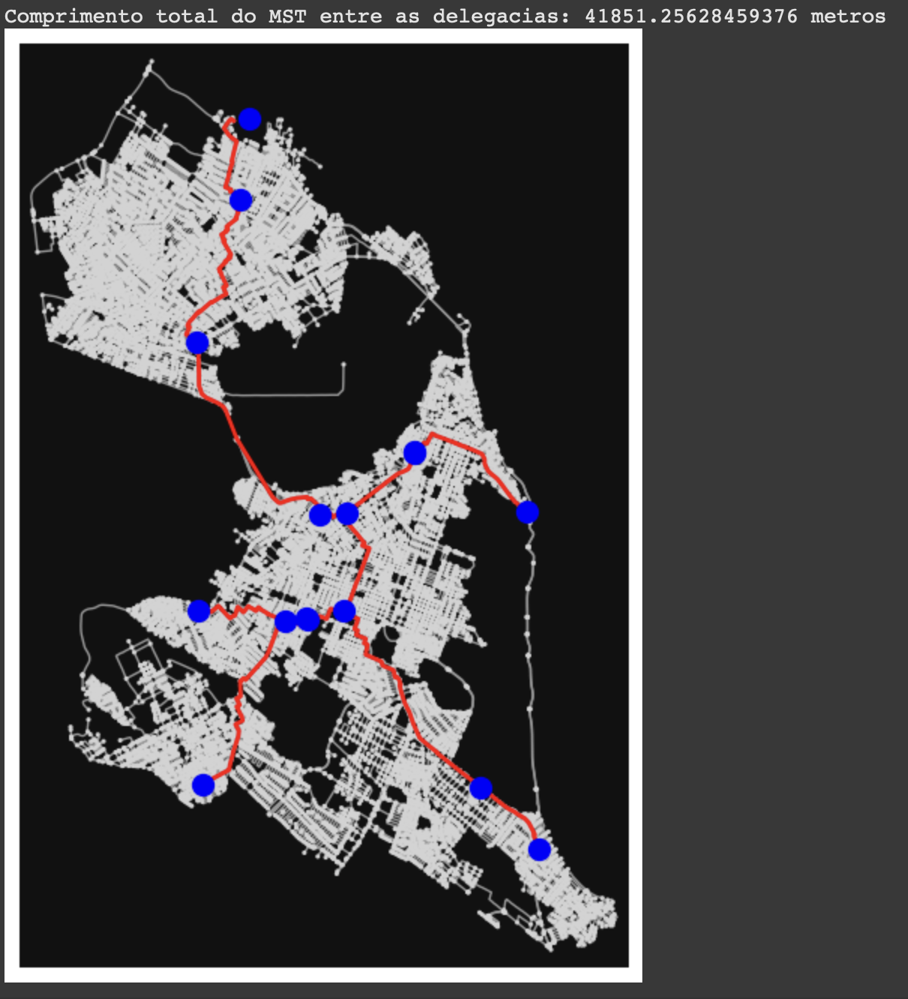

# Análise de Conectividade entre Delegacias de Polícia em Natal

Este projeto analisa a conectividade entre as delegacias de polícia da cidade de Natal, Rio Grande do Norte, utilizando a biblioteca OSMnx para obter dados do OpenStreetMap e calcular a árvore geradora mínima (MST) entre os pontos.

## Metodologia

1. **Obtenção dos Dados:** Utilizamos a biblioteca OSMnx para baixar o grafo viário da cidade de Natal, representando as ruas e estradas como um grafo. O grafo é então convertido para um grafo não direcionado para facilitar o cálculo da MST.

2. **Definição dos Pontos de Interesse (Delegacias):**  As coordenadas geográficas de cada delegacia foram definidas manualmente, criando um dicionário com os nomes e as respectivas coordenadas de latitude e longitude.

3. **Encontrando os Nós Mais Próximos:** Para cada delegacia, encontramos o nó mais próximo no grafo viário utilizando a função `ox.distance.nearest_nodes`.

4. **Construindo o Grafo das Delegacias:** Criamos um grafo completo, onde cada nó representa uma delegacia e a aresta entre dois nós representa a menor distância (em termos de comprimento da rota) entre as delegacias correspondentes. A distância entre as delegacias é calculada utilizando o algoritmo de caminho mais curto de Dijkstra.

5. **Calculando a Árvore Geradora Mínima (MST):** A MST é calculada usando o algoritmo de Prim, fornecido pela biblioteca NetworkX. A MST representa a rede de menor comprimento total que conecta todas as delegacias.

6. **Visualização:** O resultado é visualizado em um mapa, com o grafo viário da cidade como fundo e as arestas da MST destacadas em vermelho, conectando as delegacias representadas por pontos azuis.

## Resultados

A imagem a seguir mostra o grafo gerado, com a árvore geradora mínima entre as delegacias destacada em vermelho.

## Dados Adicionais

O código também inclui a opção de calcular um bounding box com um padding determinado para restringir a visualização da área do mapa. Isso pode otimizar o processo de plot.

## Conclusões

A MST gerada fornece uma representação visual e quantitativa da conectividade entre as delegacias de Natal. O comprimento total da MST indica a extensão da rede necessária para conectar todas as delegacias com o menor custo de distância. Esta análise pode auxiliar na tomada de decisões estratégicas relacionadas à gestão das delegacias, como otimização de recursos, roteamento de patrulhas e planejamento de operações.

## Bibliotecas Utilizadas

* **OSMnx:** Para obter dados de mapas do OpenStreetMap.
* **NetworkX:** Para trabalhar com grafos e calcular a MST.
* **Matplotlib:** Para visualização dos resultados.
